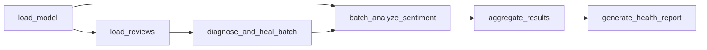

# Self-Healing Dataflow - Technical Guide


---

## Table of Contents

- [Project Overview](#project-overview)
- [Architecture &amp; Design Decisions](#architecture--design-decisions)
- [Tech Stack](#tech-stack)
- [Repository Structure](#repository-structure)
- [Installation &amp; Setup](#installation--setup)
- [Configuration](#configuration)
- [Running the Pipeline](#running-the-pipeline)
- [Data Contracts](#data-contracts)
- [Self-Healing Rules](#self-healing-rules)
- [Output &amp; Health Report](#output--health-report)
- [Implementation History](#implementation-history)
- [Debugging History](#debugging-history)
- [Operations &amp; Troubleshooting](#operations--troubleshooting)
- [Performance &amp; Validation](#performance--validation)
- [Known Caveats
  ](#known-caveats)

---

## Project Overview

This project implements a fault-tolerant, batch-oriented NLP pipeline that:

1. Loads review data from a large JSON dataset
2. Diagnoses malformed or low-quality text fields
3. Heals/normalizes broken records automatically
4. Runs sentiment classification through OLLAMA (`llama3.2`)
5. Aggregates metrics and writes a structured JSON summary
6. Emits a pipeline health report (`HEALTHY`, `WARNING`, `DEGRADED`, `CRITICAL`)

### Key Capabilities

- **Resilience-first ingestion:** protects inference from malformed text records
- **Deterministic healing layer:** normalizes common bad-input scenarios before LLM calls
- **Graceful degradation:** if model/host is unavailable per record, output is still produced with degraded status
- **Batch-oriented execution:** configurable `batch_size` and `offset` for controlled processing windows
- **Operational observability:** task-level logs, aggregate run metrics, and a final health status
- **Local-first inference:** uses OLLAMA (`llama3.2` by default) to avoid external API dependency

### End-to-End Flow

```
load_model → load_reviews → diagnose_and_heal_batch → 
batch_analyze_sentiment → aggregate_results → generate_health_report
```

---

## Architecture & Design Decisions

### DAG Flow Diagram



### Task Responsibilities

| Task                        | Purpose                                                       | Output                                  |
| --------------------------- | ------------------------------------------------------------- | --------------------------------------- |
| `load_model`              | Connect to OLLAMA, validate/pull model if needed              | Model metadata dict                     |
| `load_reviews`            | Read JSONL reviews with `batch_size` + `offset`           | List of raw review dicts                |
| `diagnose_and_heal_batch` | Apply quality diagnosis and text healing                      | List of healed review dicts             |
| `batch_analyze_sentiment` | Execute sentiment inference for each healed review            | List of inference results               |
| `aggregate_results`       | Build summary metrics, distributions, and persist output file | Summary dict (without full `results`) |
| `generate_health_report`  | Compute pipeline health classification                        | Health report dict                      |

### Why Airflow (vs one script)

- Task-level retries and timeouts
- Better observability (UI + logs per task/run)
- Run history and reproducibility
- Safer orchestration via explicit task dependencies
- Built-in monitoring and alerting capabilities

### Why OLLAMA (local LLM)

- No external API dependency for inference
- Better privacy (data remains local)
- Cost control for very large datasets
- Consistent model versioning and behavior
- No rate limiting concerns

### Why JSON Input/Output

- Input dataset is newline-delimited JSON records
- Output JSON preserves nested metadata, healing actions, confidences, and summary metrics
- Easy to consume by dashboards, APIs, and downstream data systems
- Human-readable for debugging and validation

---

## Tech Stack

- **Orchestration:** Apache Airflow 3 (`airflow.sdk` taskflow API)
- **Inference backend:** OLLAMA (local host)
- **NLP/ML packages:** `transformers`, `torch`, `ollama>=0.6.0`
- **Language/runtime:** Python 3.8+
- **Database:** PostgreSQL (via `psycopg2-binary>=2.9.0`)
- **Persistence/output:** JSON files on local filesystem
- **Testing:** `pytest` (framework in place)

---

## Repository Structure

```text
self-healing-dataflow/
├── dags/
│   └── agentic_pipeline_dag.py      # Main DAG definition
├── input/
│   └── input_data.json  # Source data
├── output/                           # Generated summaries
├── logs/                             # Airflow task logs
│   └── dag_id=self_healing_pipeline/
├── models/                           # Model artifacts (optional)
├── requirements.txt                  # Python dependencies
├── airflow.cfg                       # Airflow configuration
├── README.md                         # Quick start guide
└── TECHNICAL_GUIDE.md               # This document
```

---

## Installation & Setup

### Prerequisites

- Python 3.8+ with virtual environment support
- OLLAMA installed and available on the machine
- Local model available/pullable (default: `llama3.2`)
- Sufficient disk space for logs and output files

### First-Time Installation

From the project root:

```bash
# Create and activate virtual environment
python -m venv venv
source venv/bin/activate

# Upgrade pip and install dependencies
pip install --upgrade pip
pip install -r requirements.txt
```

### Initialize Airflow Metadata

Use this project directory as `AIRFLOW_HOME`:

```bash
export AIRFLOW_HOME=$PWD
airflow db migrate
airflow dags reserialize
airflow dags list
```

Verify the DAG appears:

```bash
airflow dags list | grep self_healing_pipeline
```

---

## Configuration

### Environment Variables (Read by DAG)

| Variable                     | Default                                        | Description                           |
| ---------------------------- | ---------------------------------------------- | ------------------------------------- |
| `PIPELINE_BASE_DIR`        | `/userX/self-healing-dataflow`               | Base project path                     |
| `PIPELINE_INPUT_FILE`      | `${PIPELINE_BASE_DIR}/input/input_data.json` | Input JSONL file                      |
| `PIPELINE_OUTPUT_DIR`      | `${PIPELINE_BASE_DIR}/output/`               | Output folder                         |
| `PIPELINE_MAX_TEXT_LENGTH` | `2000`                                       | Maximum text length before truncation |
| `OLLAMA_HOST`              | `http://localhost:11434`                     | OLLAMA endpoint                       |
| `OLLAMA_MODEL`             | `llama3.2`                                   | Default model name                    |
| `OLLAMA_TIMEOUT`           | `120`                                        | Configured timeout value              |
| `OLLAMA_RETRIES`           | `3`                                          | Per-review retry attempts             |

### Runtime DAG Parameters

Pass these when triggering the DAG:

| Param            | Type    | Default                 | Description                  |
| ---------------- | ------- | ----------------------- | ---------------------------- |
| `input_file`   | string  | `PIPELINE_INPUT_FILE` | Source JSONL path            |
| `batch_size`   | integer | `100`                 | Number of records to process |
| `offset`       | integer | `0`                   | Start index in input stream  |
| `ollama_model` | string  | `OLLAMA_MODEL`        | Model override for run       |

---

## Running the Pipeline

### Step 1: Start OLLAMA

In a dedicated terminal:

```bash
ollama serve
```

Pull the model (first time only):

```bash
ollama pull llama3.2
```

Verify model availability:

```bash
ollama list
```

### Step 2: Start Airflow

Use the project directory as `AIRFLOW_HOME`:

```bash
cd /userX/self-healing-dataflow
source venv/bin/activate
export AIRFLOW_HOME=$PWD
airflow standalone
```

This starts both the webserver (http://localhost:8080) and scheduler.

### Step 3: Unpause and Trigger the DAG

In another terminal:

```bash
source venv/bin/activate
export AIRFLOW_HOME=$PWD

# Unpause the DAG (first time only)
airflow dags unpause self_healing_pipeline

# Trigger with default parameters
airflow dags trigger self_healing_pipeline

# Or trigger with custom parameters
airflow dags trigger self_healing_pipeline \
  --conf '{"batch_size": 100, "offset": 0, "ollama_model": "llama3.2"}'
```

### Step 4: Monitor Execution

```bash
# List recent runs
airflow dags list-runs -d self_healing_pipeline

# Check task states for a specific run
airflow tasks states-for-dag-run self_healing_pipeline <run_id>

# View output files
ls -lh output/

# Tail task logs
tail -f logs/dag_id=self_healing_pipeline/run_id=*/task_id=*/attempt=*.log
```

---

## Data Contracts

### Input Contract

- **File format:** JSON Lines (one JSON object per line)
- **Required fields:** `review_id`, `business_id`, `stars`, `text`
- **Optional metadata:** `user_id`, `date`, `useful`, `funny`, `cool`

Example input record:

```json
{
  "review_id": "abc123",
  "business_id": "biz001",
  "user_id": "user999",
  "stars": 4,
  "text": "Great service and quick staff.",
  "date": "2020-01-10",
  "useful": 3,
  "funny": 0,
  "cool": 1
}
```

### Model Inference Contract

The model is prompted to return JSON:

```json
{"sentiment": "POSITIVE", "confidence": 0.95}
```

Supported sentiment labels: `POSITIVE`, `NEGATIVE`, `NEUTRAL`

If JSON parsing fails, fallback logic infers sentiment from text keywords and applies default confidence.

### Output Contract

Written to `output/` with pattern:

```
sentiment_analysis_summary_<YYYY-MM-DD-HH-MM-SS>_Offset<offset>.json
```

**Top-level keys:**

- `run_info` - batch metadata (timestamp, batch_size, offset, input_file)
- `totals` - counts (processed, success, healed, degraded)
- `rates` - ratios (success_rate, healing_rate, degradation_rate)
- `sentiment_distribution` - counts by sentiment label
- `healing_statistics` - counts by healing action type
- `star_sentiment_correlation` - sentiment distribution per star rating
- `average_confidence` - mean confidence by record status
- `results` - array of per-record inference results

**Per-record result schema:**

```json
{
  "review_id": "abc123",
  "business_id": "biz001",
  "stars": 4,
  "text": "Great service...",
  "original_text": null,
  "predicted_sentiment": "POSITIVE",
  "confidence": 0.92,
  "status": "success",
  "healing_applied": false,
  "healing_action": null,
  "error_type": null,
  "metadata": { ... }
}
```

---

## Self-Healing Rules

The `diagnose_and_heal_batch` task applies per-record validation and normalization:

| Issue                      | Detection                       | Healing Action           | Status      |
| -------------------------- | ------------------------------- | ------------------------ | ----------- |
| Missing text               | `text is None`                | Fill with placeholder    | `healed`  |
| Wrong data type            | `not isinstance(text, str)`   | Safe string conversion   | `healed`  |
| Empty/whitespace-only text | `not text.strip()`            | Fill with placeholder    | `healed`  |
| Special characters only    | No alphanumeric content         | Replace with safe marker | `healed`  |
| Text too long              | `len(text) > MAX_TEXT_LENGTH` | Truncate with ellipsis   | `healed`  |
| Valid text                 | All checks pass                 | Use as-is                | `success` |

Each healed record tracks:

- `was_healed` (boolean)
- `healing_action` (action type string)
- `error_type` (issue classification)
- `original_text` (if modified)
- `healed_text` (text used for model inference)

---

## Output & Health Report

### Health Classification Logic

The `generate_health_report` task computes pipeline status:

```python
if degraded > total * 0.1:
    health_status = 'CRITICAL'      # >10% failed
elif degraded > 0:
    health_status = 'DEGRADED'      # Some failures
elif healed > total * 0.5:
    health_status = 'WARNING'       # >50% healing required
else:
    health_status = 'HEALTHY'       # Normal operation
```

### Health Report Schema

```json
{
  "pipeline": "self_healing_pipeline",
  "timestamp": "2026-03-04T14:44:07",
  "health_status": "HEALTHY",
  "run_info": { ... },
  "metrics": {
    "total_processed": 100,
    "success_rate": 0.95,
    "healing_rate": 0.05,
    "degradation_rate": 0.0
  },
  "sentiment_distribution": { ... },
  "healing_summary": { ... },
  "average_confidence": { ... }
}
```

---

## Implementation History

### Code Fixes Applied During Development

In `dags/agentic_pipeline_dag.py`, the following issues were resolved:

1. **Task scope/indentation issue:** `generate_health_report` and DAG wiring

   - Symptom: Task not visible in DAG graph
   - Fix: Moved task definition and dependencies to correct scope level
2. **Return path bug in `_load_ollama_model()`:**

   - Symptom: `NoneType` XCom error in downstream task
   - Cause: Return statement only in exception block
   - Fix: Moved model metadata return outside exception-only scope

These fixes resolved DAG parsing, task dependency, and runtime XCom failures.

---

## Debugging History

### Error 1: DAG Not Found

**Error message:**

```
Dag id self_healing_pipeline not found in DagModel
```

**Root cause:**
Airflow metadata DB did not have the DAG registered under the active `AIRFLOW_HOME` context.

**Commands used to fix:**

```bash
export AIRFLOW_HOME=/userX/self-healing-dataflow
airflow db migrate
airflow dags reserialize
airflow dags list
```

**Why this worked:**
`db migrate` ensured schema/state was valid, and `dags reserialize` re-parsed and registered DAG definitions.

---

### Error 2: Shell Startup Warnings

**Error pattern:**
Shell attempted to `source` a directory path, causing startup noise and environment instability.

**Root cause:**
Invalid line in `~/.bashrc`:

```bash
source /userX/.config/bash-completion/completions/  # Directory, not a file
```

**Fix:**

- Remove invalid `source` line
- Keep single valid Airflow home export:

```bash
export AIRFLOW_HOME=/userX/self-healing-dataflow
```

**Why this worked:**
Eliminating invalid startup commands prevents shell init failures and keeps runtime environment deterministic.

---

### Error 3: Runtime Crash in Sentiment Task

**Error message:**

```
'NoneType' object has no attribute 'get'
```

**Root cause:**
`batch_analyze_sentiment` expected `model_info` dict from `load_model`, but `_load_ollama_model()` returned `None` on non-exception code path.

**Fix implemented:**
Move model validation + return dictionary outside exception-only block so return executes in all successful paths.

**Why this worked:**
Airflow XCom then received a valid dict, making downstream `model_info.get(...)` safe.

---

### Error 4: Runs Stuck in Queued State

**Observed symptom:**
DAG runs remained queued indefinitely, no task logs appeared.

**Root cause:**
Multiple scheduler processes running concurrently, creating scheduling conflicts.

**Commands used:**

```bash
ps aux | grep -E "airflow (standalone|scheduler|webserver)" | grep -v grep
kill <old_scheduler_pid_1> <old_scheduler_pid_2> ...
```

**Why this worked:**
Leaving only one active scheduler removes race/ownership conflicts in task scheduling.

---

### Error 5: DAG Paused After Cleanup

**Observed symptom:**
DAG existed but did not execute triggered runs.

**Root cause:**
DAG was paused (default state after certain operations).

**Command used:**

```bash
airflow dags unpause self_healing_pipeline
```

**Why this worked:**
Unpaused DAGs are schedulable; queued runs can advance to task execution.

---

## Operations & Troubleshooting

### DAG Does Not Appear in Airflow

**Checklist:**

1. Verify `AIRFLOW_HOME` is set correctly
2. Check DAG file syntax for Python errors
3. Rescan DAGs:

```bash
export AIRFLOW_HOME=$PWD
airflow db migrate
airflow dags reserialize
airflow dags list
```

### Runs Remain in Queued State

**Checklist:**

1. Ensure DAG is unpaused: `airflow dags unpause self_healing_pipeline`
2. Verify only one scheduler is running: `ps aux | grep "airflow scheduler"`
3. Check scheduler logs for errors: `tail -f logs/scheduler/*.log`
4. Restart scheduler if needed

### OLLAMA Connection/Model Issues

**Checklist:**

1. Verify OLLAMA service is running: `curl http://localhost:11434/api/tags`
2. List available models: `ollama list`
3. Pull model if missing: `ollama pull llama3.2`
4. Check `OLLAMA_HOST` environment variable matches actual endpoint
5. Review task logs for connection errors

### No Output File Generated

**Checklist:**

1. Check `aggregate_results` task status/logs
2. Confirm `PIPELINE_OUTPUT_DIR` exists and is writable
3. Confirm upstream tasks succeeded: `load_model`, `batch_analyze_sentiment`
4. Check disk space availability

### High Degradation Rate

**Investigation steps:**

1. Review `healing_statistics` in output JSON
2. Check most common `error_type` values
3. Examine sample degraded records in results array
4. Consider adjusting healing rules or input data quality

---

## Performance & Validation

### Run Result Validation

Validated successful run with parameters `batch_size=10`, `offset=0`:

- **Health status:** `HEALTHY`
- **Reviews processed:** 10
- **Success rate:** 1.0
- **Sentiment distribution:** POSITIVE=6, NEGATIVE=2, NEUTRAL=2
- **Average confidence:** 0.88
- **Output file:** Generated in `output/`

**Execution timing (from logs):**

- Trigger to completion: approximately 9m 33s
- First task start to completion: approximately 7m 34s

### Performance Notes

- Start with small `batch_size` (10-50) for validation
- Increase gradually based on model latency and host resources
- `OLLAMA_RETRIES` improves resilience but increases total run time under instability
- Long review text is truncated before inference to cap model input size
- Each review inference takes ~5-10 seconds on average hardware

### Typical Runtime

| Batch Size | Estimated Duration | Notes                       |
| ---------- | ------------------ | --------------------------- |
| 10         | ~2-3 minutes       | Good for testing/validation |
| 100        | ~15-20 minutes     | Balanced for iterative work |
| 1,000      | ~2-3 hours         | Large production batch      |

*Times vary based on hardware, model size, and text complexity*

---

## Known Caveats

### Current Implementation Issues

1. **Metadata bug in `aggregate_results`:**

   - `run_info.batch_size` is incorrectly sourced from `offset` parameter
   - Should read from `batch_size` parameter instead
2. **Typo in healing metadata:**

   - `error_type` for wrong text type is spelled as `wront_type`
   - Should be `wrong_type`
3. **Timeout not enforced:**

   - `OLLAMA_TIMEOUT` is configured but not currently passed to OLLAMA client options
   - Inference calls may hang longer than intended

These issues are safe for local experimentation but should be corrected before production deployment.

---


## Restart Without Reinstalling

You do **not** need to reinstall Airflow each time.

**Typical restart flow:**

Terminal 1 (Airflow):

```bash
cd /userX/self-healing-dataflow
source venv/bin/activate
export AIRFLOW_HOME=$PWD
airflow standalone
```

Terminal 2 (Trigger):

```bash
source venv/bin/activate
export AIRFLOW_HOME=$PWD
airflow dags trigger self_healing_pipeline --conf '{"batch_size": 100, "offset": 0}'
```

Only reset metadata/logs when you intentionally want a clean slate.

---

## Additional Resources

- [Apache Airflow Documentation](https://airflow.apache.org/docs/)
- [OLLAMA Documentation](https://github.com/ollama/ollama)
- [Yelp Dataset Documentation](https://www.yelp.com/dataset/documentation/main)
